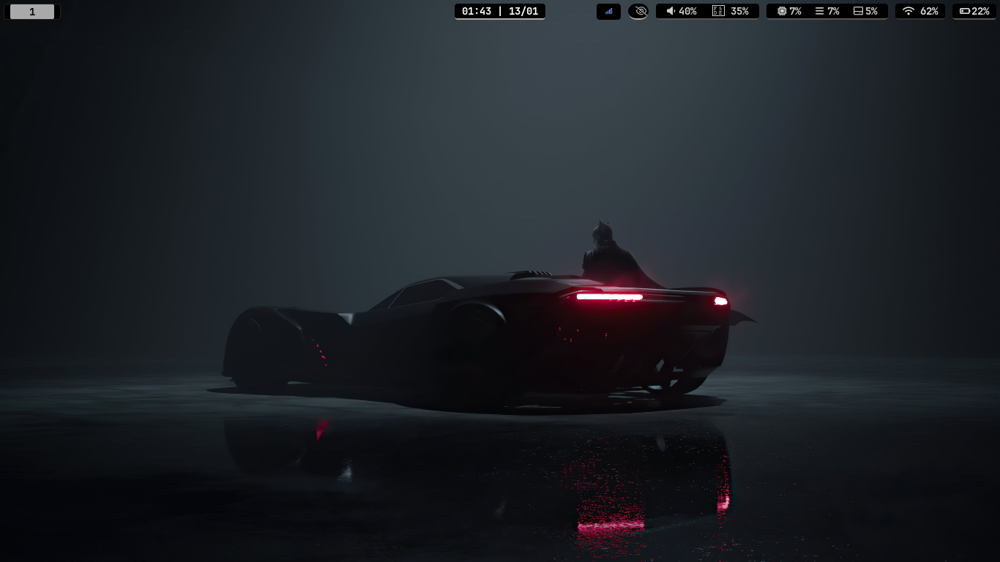
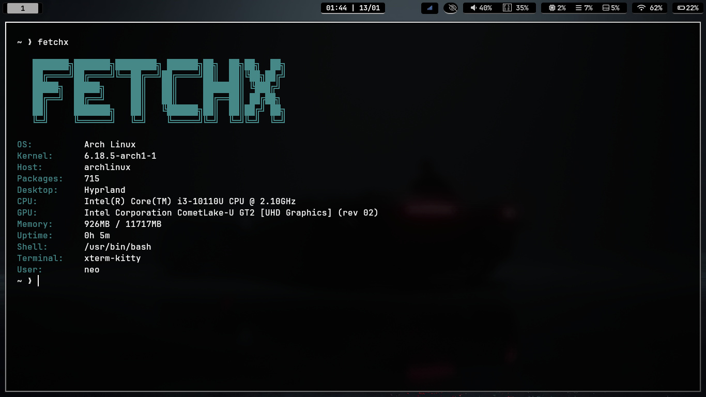

# Hyprland: Dark Knight Edition

> "It's not who I am underneath, but what I do that defines me."



A hyper-minimalist, **tactical monochrome** configuration for Arch Linux. Designed for focus, speed, and immersion.

---

## 📸 Gallery

| **Terminal (Kitty + FetchX)** | **App Launcher (Wofi)** |
| :---: | :---: |
|  |  |

---

## 🗡️ Aesthetics
*   **Theme**: Pure Black (`#000000`) & Silver Gradient (`#555555`).
*   **Hyprland**: 1px borders with active gradient. Cinematic animations.
*   **Hyprlock**: "The Void" Layout. No images. Massive typography.
*   **Waybar**: Floating Pills. Modular and clean.
*   **Cursor**: Bibata Modern Ice.
*   **Shell**: Starship (Tactical Preset) + FetchX (Auto-run).

## 🚀 Installation

**Requirements**: A fresh install of Arch Linux.

```bash
# 1. Clone the repository
git clone https://github.com/v9mirza/v9-hyprdots.git
cd v9-hyprdots

# 2. Run the bootstrap script
chmod +x bootstrap.sh
./bootstrap.sh
```

**What it does:**
1.  Installs all dependencies (Hyprland, Kitty, Waybar, Fonts, etc.).
2.  Backs up your existing configs.
3.  Deploys the "Dark Knight" configuration.
4.  Installs **FetchX** and configures `.bashrc` for auto-launch.

## ⌨️ Controls

| Action | Keybinding |
| :--- | :--- |
| **Terminal** | `Super` + `Enter` |
| **App Launcher** | `Super` + `D` |
| **File Manager (Yazi)** | `Super` + `E` |
| **Close Window** | `Super` + `Q` |
| **Lock Screen** | `Super` + `L` |
| **Power Menu** | `Super` + `X` |
| **System Monitor** | `Super` + `M` |
| **Screenshot** | `Print` (Full) / `Shift` + `Print` (Region) |
| **Reload Config** | `Super` + `Shift` + `C` |
| **Exit Hyprland** | `Super` + `Shift` + `Q` |

## 🛠️ Customization
Edit the files in `~/.config/hypr/` to tweak settings.
*   **Animations**: `~/.config/hypr/animations.conf`
*   **Keybinds**: `~/.config/hypr/keybinds.conf`
*   **Looks**: `~/.config/hypr/general.conf`

---
*Built with precision.*
