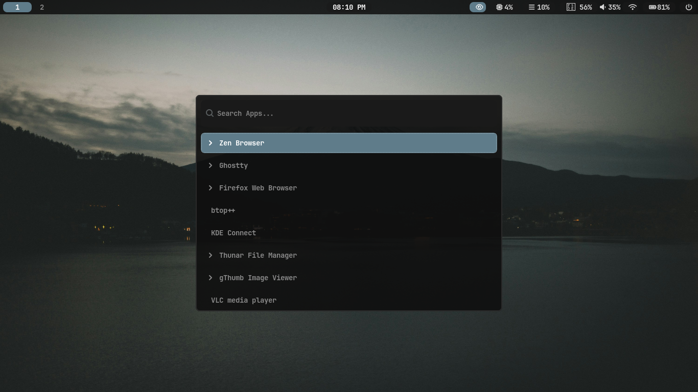

# V9-hyprdots


A minimal, monochrome configuration for Hyprland.
Designed for focus with a **"Blur the shell, not the work"** philosophy.

---

## Identity

*   **Palette**: Monochrome Dark (`#0f0f0f`)
*   **Accent**: Steel Blue (`#5f7c8a`)
*   **Radius**: Subtle (UI: 8px, Tiled: 0-4px)
*   **Blur**: Enabled on Shell (Waybar, Wofi, Dunst)

## Highlights

*   **Performance First**: Zero-bloat config optimized for speed.
*   **Pixel Perfect**: Every border, gap, and radius is calculated (8px/4px).
*   **Steel Blue**: A unified accent color `#5f7c8a` across all apps.
*   **Ghostty Default**: GPU-accelerated terminal with V9 shaders.

## Showcase

| | |
|:---:|:---:|
|  |  |
| **Home Desktop** | **Terminal Workflow** |
|  |  |
| **App Launcher** | **Power Menu** |


## Tech Stack

| Component | Tool | Description |
| :--- | :--- | :--- |
| **Window Manager** | Hyprland | Dwindle Layout, 4px Gaps |
| **Bar** | Waybar | Floating, 85% Opacity, Blur |
| **Terminal** | Ghostty | V9-hyprdots Config, 0.9 Opacity |
| **Launcher** | Wofi | Blur, Steel Blue Selection |
| **Notification** | Dunst | Dark Blur, Blue Border |
| **Lock Screen** | Hyprlock | Minimalist Void |

## Project Structure

```plaintext
v9-hyprdots/
├── bootstrap.sh       # Installer (V9 Edition)
├── config/
│   ├── hypr/          # Core Configs (general.conf using #5f7c8a)
│   ├── waybar/        # CSS with 8px radius
│   ├── ghostty/       # V9-hyprdots Terminal
│   └── wofi/          # Blur enabled
```

## Installation

```bash
git clone https://github.com/v9mirza/v9-hyprdots.git
cd v9-hyprdots
chmod +x bootstrap.sh
./bootstrap.sh
```

## Controls

| Action | Keybinding |
| :--- | :--- |
| **Terminal** | `Super` + `Enter` |
| **App Launcher** | `Super` + `D` |
| **File Manager** | `Super` + `E` |
| **System Monitor** | `Super` + `M` |
| **Power Menu** | `Super` + `X` |
| **Close Window** | `Super` + `Q` |
| **Float Window** | `Super` + `F` |
| **Clipboard** | `Super` + `V` |
| **Screenshot (Full)** | `Print` |
| **Lock Screen** | `Super` + `L` |

---
*V9-hyprdots by v9mirza.*
